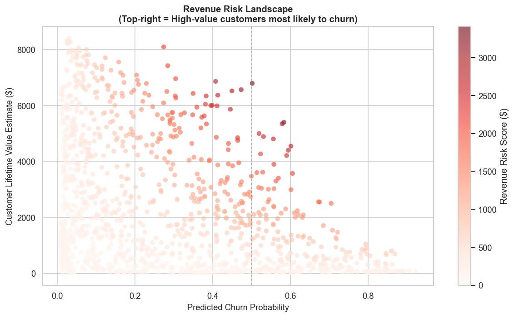

# Customer Churn & Revenue Risk Analytics Platform

> An end-to-end machine learning system to predict customer churn and quantify revenue risk — built with Python, SQL, and AWS.



---

## Project Overview

Customer churn is one of the most costly problems in subscription-based businesses. This platform ingests multi-source customer data, engineers predictive features via SQL and Python, trains classification models, and surfaces high-risk customers through an interactive dashboard — framed as a **revenue risk score**, not just a churn probability.

**Business question answered:** *Which customers are most likely to leave, and how much revenue is at risk if they do?*

---

## Architecture

```
Raw Data (CSV)
     │
     ▼
AWS S3 (data lake)
     │
     ▼
AWS RDS / PostgreSQL (SQL feature engineering)
     │
     ▼
Python ML Pipeline (EDA → Feature Engineering → Modeling)
     │
     ▼
Trained Model + Risk Scores
     │
     ▼
Streamlit Dashboard (churn risk + revenue impact)
```

---

## Tech Stack

| Layer            | Tool/Service                        |
|------------------|-------------------------------------|
| Cloud Storage    | AWS S3                              |
| Database         | AWS RDS (PostgreSQL)                |
| Data Processing  | Python, Pandas, NumPy               |
| SQL Engineering  | PostgreSQL, SQLAlchemy              |
| Modeling         | Scikit-learn, XGBoost               |
| Visualization    | Matplotlib, Seaborn, Plotly         |
| Dashboard        | Streamlit                           |
| Version Control  | Git / GitHub                        |
| Environment      | Python 3.11+, virtualenv            |

---

## Dataset

**Source:** [Telco Customer Churn — IBM Sample Dataset via Kaggle](https://www.kaggle.com/datasets/blastchar/telco-customer-churn)

**Size:** 7,043 customers × 21 features

**Key fields:** tenure, MonthlyCharges, TotalCharges, Contract, InternetService, PaymentMethod, and 15 other customer attributes.

---

## Project Structure

```
customer-churn-analytics/
│
├── data/
│   ├── raw/                          # Original unmodified data (gitignored)
│   └── processed/                    # Cleaned, feature-engineered data (gitignored)
│
├── notebooks/
│   ├── 01_eda.ipynb                  # Exploratory data analysis
│   ├── 02_feature_engineering.ipynb  # Feature creation and encoding
│   └── 03_modeling.ipynb             # Model training and evaluation
│
├── src/
│   ├── data/
│   │   ├── ingest.py                 # Load data from S3 / local
│   │   └── preprocess.py             # Cleaning and type casting
│   ├── features/
│   │   └── engineer.py               # Feature engineering functions
│   ├── models/
│   │   ├── train.py                  # Model training pipeline
│   │   ├── evaluate.py               # Metrics and evaluation
│   │   └── predict.py                # Inference / scoring
│   └── dashboard/
│       └── app.py                    # Streamlit dashboard
│
├── sql/
│   ├── schema.sql                    # RDS table definitions
│   ├── feature_queries.sql           # SQL-based feature engineering
│   └── risk_scores.sql               # Revenue risk aggregations
│
├── models/                           # Saved model artifacts (gitignored)
├── reports/figures/                  # EDA and evaluation charts
├── config/config.yaml                # Project config
├── requirements.txt
└── README.md
```

---

## Key Findings from EDA

| Finding | Detail |
|---|---|
| Overall churn rate | **26.5%** — class imbalance means accuracy is a misleading metric |
| Contract type | Month-to-month: **42.7% churn** vs 11.3% (one year) and 2.8% (two year) |
| Tenure | Churned customers average **~18 months** vs ~38 months for retained |
| Monthly charges | Churned customers pay **~$74/mo** vs ~$61/mo for retained |
| Internet service | Fiber optic customers churn at **~42%** — highest risk segment |
| Payment method | Electronic check customers churn at **~45%** vs ~16% for automatic payments |
| Gender | Almost no difference in churn rate — not a useful predictive feature |

---

## Feature Engineering

7 business-motivated features engineered from EDA insights:

| Feature | Formula | Motivation |
|---|---|---|
| `clv_estimate` | MonthlyCharges × tenure | Captures total revenue generated per customer |
| `services_count` | Sum of 8 service subscriptions | More services = more embedded = lower churn |
| `charge_per_service` | MonthlyCharges / services_count | High cost per service signals poor perceived value |
| `is_month_to_month` | Binary flag | 42.7% churn rate — strongest single predictor |
| `is_electronic_check` | Binary flag | ~45% churn vs ~16% for automatic payment |
| `no_protection_services` | Binary flag | Customers without security/support churn at ~40% |
| `tenure_segment` | Binned lifecycle stage | New customers are highest churn risk |

---

## Model Results

| Metric | Logistic Regression | XGBoost |
|---|---|---|
| **AUC-ROC** | 0.8411 | **0.8463** |
| Avg Precision | 0.6281 | **0.6565** |
| F1 Score | **0.6129** | 0.5736 |
| Precision | 0.5079 | **0.6632** |
| Recall | **0.7727** | 0.5053 |

**XGBoost** is the primary production model — higher AUC-ROC and precision means when it flags a customer as at-risk, it's more often correct. Logistic regression serves as the interpretable baseline.

> **Why not accuracy?** A model predicting "no churn" always would achieve 73.5% accuracy — making accuracy a misleading metric for imbalanced classification.

**Top churn drivers (from logistic regression coefficients):**
- Increases risk: Fiber optic internet, month-to-month contract, high total charges
- Reduces risk: Long tenure, two-year contracts, tech support, online security

---

## Revenue Risk Score

```
Revenue Risk Score = Churn Probability × Estimated Customer Lifetime Value
```

**Results on 7,043 customers:**
- Predicted churners: **1,455** (20.7% predicted churn rate)
- Total revenue at risk: **$803,673**
- Highest-risk segment: Month-to-month contracts (~$780k of total risk)

---

## Setup & Installation

### 1. Clone the repo
```bash
git clone https://github.com/ekane3901/customer-churn-analytics.git
cd customer-churn-analytics
```

### 2. Create virtual environment
```bash
python -m venv venv
source venv/bin/activate
```

### 3. Install dependencies
```bash
pip install -r requirements.txt
```

### 4. Download dataset
Place the Telco CSV from [Kaggle](https://www.kaggle.com/datasets/blastchar/telco-customer-churn) into `data/raw/WA_Fn-UseC_-Telco-Customer-Churn.csv`

### 5. Run notebooks in order
```bash
jupyter notebook
# 01_eda.ipynb → 02_feature_engineering.ipynb → 03_modeling.ipynb
```

### 6. Launch dashboard
```bash
streamlit run src/dashboard/app.py
```

---

## Status

| Phase | Status |
|-------|--------|
| Data ingestion & EDA | ✅ Complete |
| Feature engineering | ✅ Complete |
| Model training (LR + XGBoost) | ✅ Complete |
| Revenue risk scoring | ✅ Complete |
| Streamlit dashboard | ✅ Complete |
| AWS S3 / RDS deployment | 🔄 In Progress |

---

## Author

**Eric Kane** — [GitHub](https://github.com/ekane3901)

*Built as a portfolio project demonstrating end-to-end data science: SQL, Python, ML modeling, cloud infrastructure, and business analytics.*
